# Geospatial Analytics with QGIS

In this part of the course, you will learn the basics of working with the freely available geographic information system QGIS. These course-related worksheets are intended to guide you through the individual exercises ("learning by doing"). The course slides include a basic introduction to geospatial information systems, their application, mapping, and various tools in QGIS ("Learning by Studying"). For your learning success, it is recommended to use both documents!

The following task sheets were deliberately written in detail to make it easier for you to do some follow-up work at home.

The following four exercise units contain different learning objectives (Some tasks are inspired by the exercises of the course "Logistiknetzwerke" by Dr. Maximilian Lukesch.):
- In **Task 1**, you create a map that shows the distribution of the population in the USA. You will learn how to read and edit data, format layers, and create maps.
- In **Task 2**, you create a map of Regensburg on which the Aldi branches are marked and in which you draw a circular route. You will learn a simple form of geocoding, creating point shapefiles, formatting points and lines, measuring distances, and creating line shapefiles.
- **Task 3** builds on the material from Task 2. They analyze the market reach of the Regensburg Aldi branches. Here you will learn how to use different geo tools (buffer, intersection, dissolve), how to prepare attribute tables and how to calculate new attributes.
- In **Task 4**, you examine a fictitious distribution network in Bavaria. You will learn various analysis methods relevant to logistics, including the generation of centroids, distance matrices and Voronoi polygons, as well as the mapping and formatting of goods flows.

A few hints should be given for your further work with QGIS:
- QGIS is a powerful program – an introductory course only gives you a jump-start. Exploiting the possibilities of QGIS depends on your personal efforts in understanding and using the program.
- Search for freely available data and discover the potential of QGIS!
- The QGIS community is very active: you can almost always find an answer to your question by searching the web.
- QGIS has many plugins: There may be a plugin that can help you with your specific problem! If in doubt, google your problem in English.

## Task 1: North America

### Problem
In the first exercise, you will create a professional and complete map of the United States, showing the population distribution of each state. On the one hand, you should format the states according to color intensity, and on the other hand, mark the three most populous states with a red border. In addition, the states should be provided with their respective state abbreviation.

Use the following data for this:
- Path: Exercise 1
    - States.shp
    - States_demog.dbf

### Walkthrough
- Copy the data set to your personal drive. Make a note of the storage path. Open QGIS.
- Load the above data into QGIS.
- Change the coordinate reference system of the project  and the states layer to EPSG:4269.

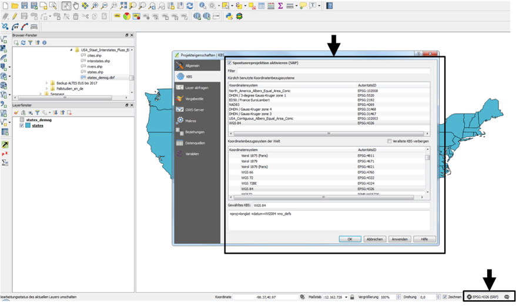
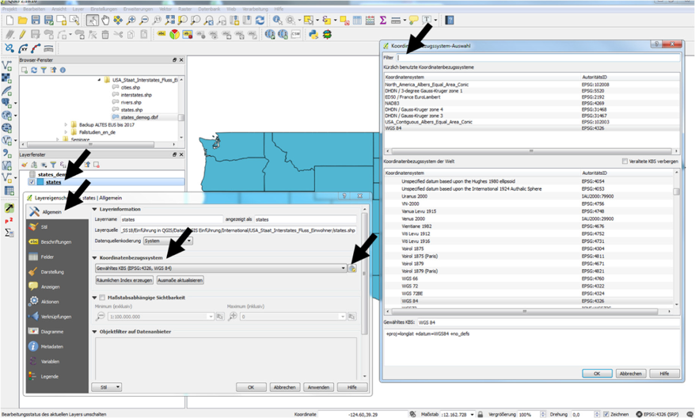

- **TIP**: If you lose sight of a specific layer, you can right-click on the layer and select the "Zoom to layer" option.
- Link the states layer to the .dbf:
    - Right-click "states", properties, shortcuts, add shortcut (green plus). Link layers -> select the database here. Link field and target field are "STATE_FIPS". Select only "POP2004" as the linked field.
    - If you now check the layer's attribute table (right-click -> Open attribute table), you will see that a new column has been added.
- In the following we have to do two separate formatting tasks. Once using a gradient, once using a border. It makes sense to create two separate shapefiles for this. In the following, we therefore separate a shape called "States" and a shape called "Largest States".
    - Right click on States layer -> Save as.
    - Select the "Browse" field for "File name" and call up the storage path on your drive. Select "Large States" as the file name.
    - Rename the other layer to "States" (right click on layer -> Rename).
    - You now have two shapefiles that currently have the same content.
- First, let's "clip" the "Largest States" layer. It should only include the three largest states:
    - Right click on Layer -> Open attribute table
    - Sort the states in descending order of population (click on the column header).
    - Select the top three objects (hold down CTRL) and select the Invert Object Selection option.
    - Click on the "Turn on editing mode" button (small pencil). Then click "Delete Selected Items" (trash can). Exit edit mode by clicking the small pen again. Save the changes.

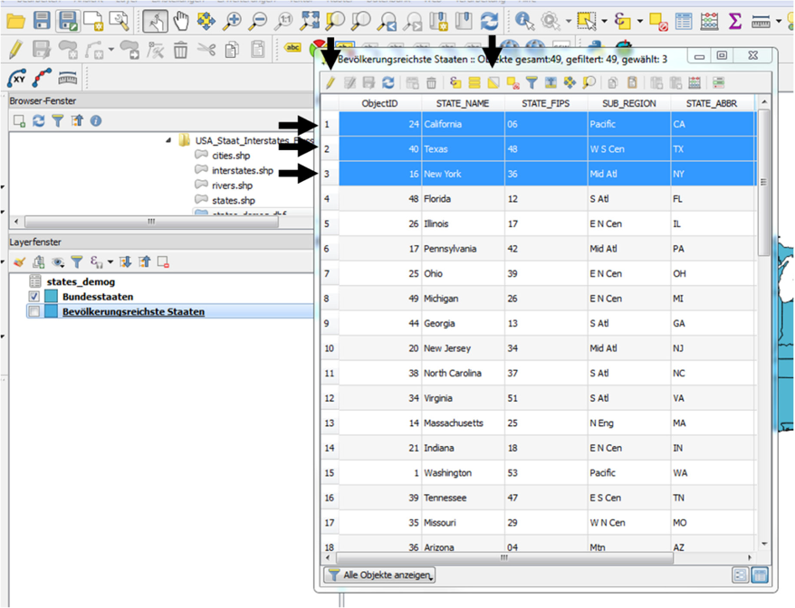

- Make sure the "Most Populous States" layer is on top of the "States" layer in your Layers win-dow. Otherwise, drag and drop it up. Format it as a transparent layer with a thick red border:
    - Right click on Layer -> Properties -> Style.
    - Click on "Simple filling" in the upper window, then on the color bar below under Symbol layer type / Filling. In the "Choose fill color" window that appears, lower the "Opacity" slider to 0%, then confirm.
    - Further down in the window you can format the frame. Change the border color to red and increase the border strength to 1.5. Click "Apply" and then "Ok".
- Next, the States layer is formatted:
    - Right click on Layer -> Properties -> Style.
    - At the top, choose Graduated instead of Single Icon.
    - For "Column" select "POP_2004". Then select a color gradient that suits you under "Color gradient".
    - Under Mode (below the table window), select the entry "Nice Interruptions". Under "Clas-ses" on the right, select 7 classes. Click "Classify" – each object has now been assigned a color based on its population. If you click on "Apply" below, you can already see the effect in the map window.
    - Finally, the states have to be labeled. In the properties window, click on "Labeling" and select "Label this layer" from the top menu.
    - Under "Label with" you can specify which attribute should be used for the label. Select "STATE_ABBR" and click "Apply" to test it.
    - Format the caption however you like: The menu below gives you several options. One possibility would be to add a buffer to make the state names easier to read. A shad-ow would also be possible.

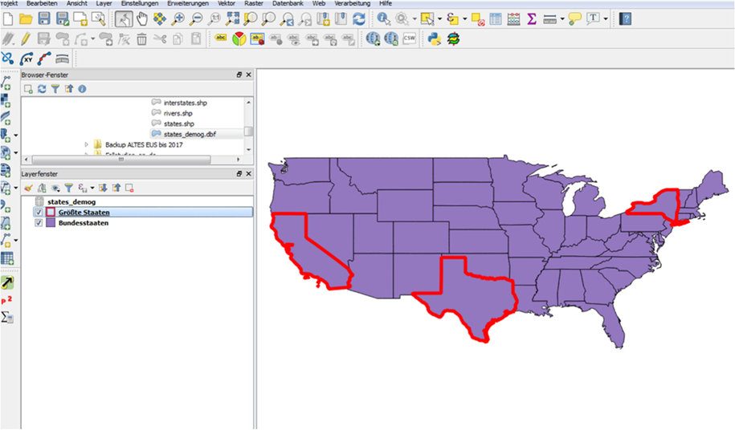
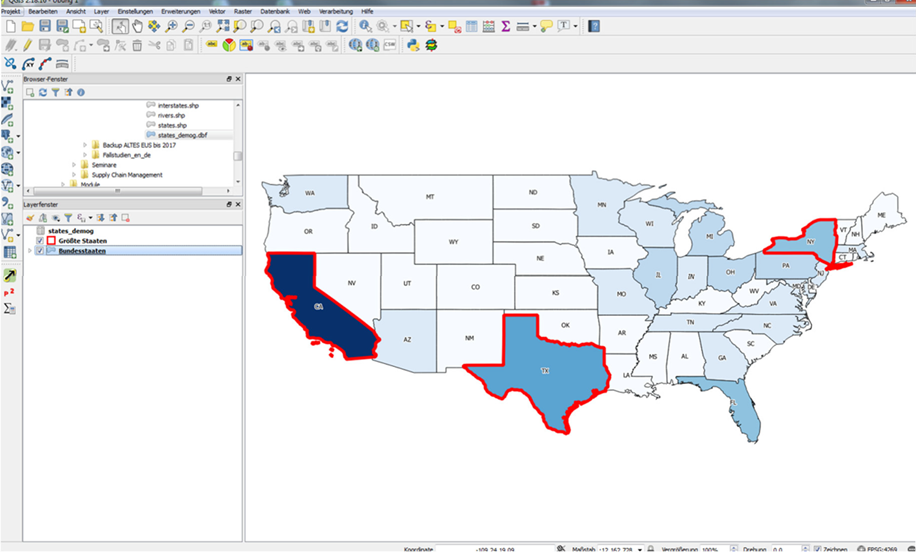

- Now all layers are ready for map creation. You can start creating a map. To do this, click on "Project" in the menu bar, then on "New Print Composer". For the name, select "Population distribution in the USA". The Print Composer opens (i.e., the map editor) from QGIS in a new window.
    - Add a card title (menu bar -> Arrangement -> Add label) and place it in the middle. In the right window under "Element properties" change the content of the caption to "Population distribution in the USA (2004)". Below you can format the title. Center the title and in-crease its font size (Font button) to 24 and set it to bold.
        - **Orientation**: On the right side you will find the "Elements" pane. Here you will find all the individual parts that you have added to the map. You can also navigate here – by clicking on a single element, it becomes editable. You can change it in the "Element properties" window below.
        - **Tip**: You can delete elements by selecting the "Select/move entry" button, then clicking on the element and selecting "Edit" from the menu bar and then "Delete".
    - Next, add the map (Menu bar -> Arrangement -> Add map). Drag the map window to the width of the workspace. Leave space below for sources. You can change the size afterwards by dragging the edge of the object.
    - Move the content of the map up a little (menu bar -> arrangement -> move content, then move the content up within the map). You can switch off the "Move content" function again by clicking on the "Select/move entry" symbol on the left edge of the screen and on a Color area.
    - Add a small map window that you place below the large map on the left. In this small map window, the New England states on the east coast should be displayed a little larger.
        - This new map is the "Map 1" item in the "Items" panel. Select it, click "Move Con-tent" (menu bar, layout) and zoom in (CTRL + mouse wheel) on the east coast. Then add a border to the little card under Element Properties.
        - It should be shown where the small map section is in the large map. In the elements window, click on "Map 0" and select the "Overviews" tab at the bottom of the ele-ment properties. Insert a new overview using the plus sign and select "Map 1" as the map frame. Under "Border Style" you can increase the transparency of the red box to 90%.
        - The small section of the map must also be labeled. Add a new caption ("Cutout: New England") and format it appropriately under Element Properties.
    - The map needs a legend. It can also be added via "Order". Place them in the lower right corner. Under Element Properties under Legend Elements click on "Update automatically" and remove the database "states_demog" by selecting it and clicking on the minus at the bottom. Then click on "States" and on the edit function below (small pencil) and rename the item "Population".
    - Next, add a scale via "Arrange". Play around with the formatting options under Element Properties. Try to create appropriate scale bar formatting. Add a scale bar to the small map as well – click on the small map under "Elements" and add the scale bar via "Arrangement".
    - Finally, the map needs a north arrow. Select the "Add picture" function via "Arrangement" and open a small frame. Under "Element properties" open the "Browse directories" tab – select a discreet north arrow.
    - Finally, we must indicate the sources used. To do this, create a label field again and add the source reference "Source: Data from the University of Regensburg".

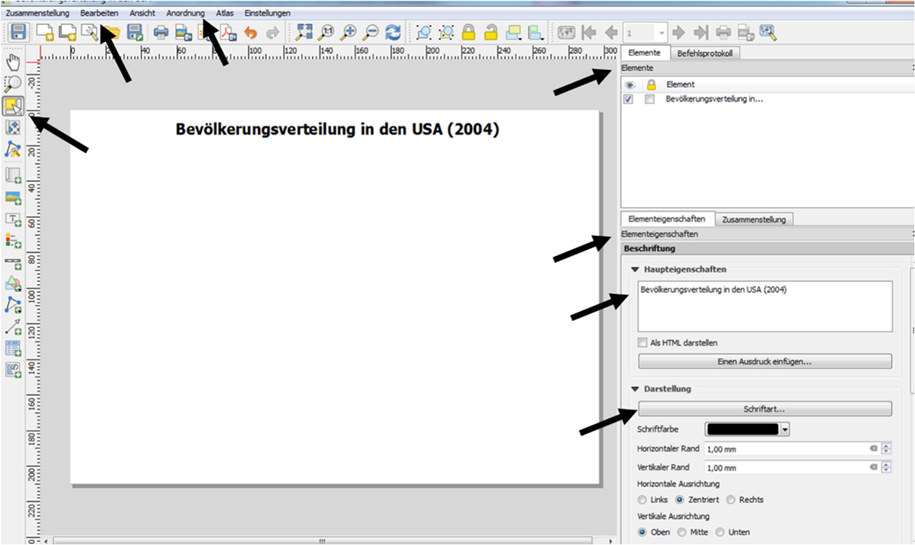
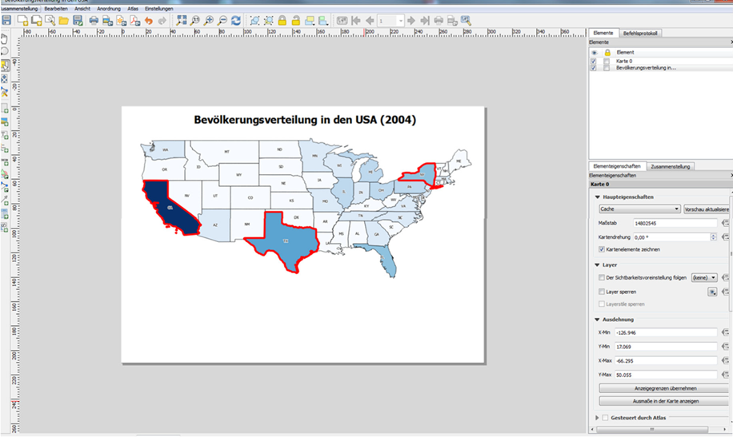
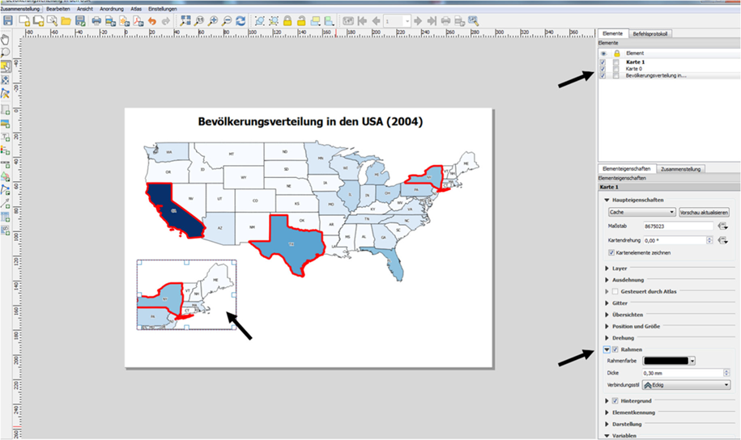
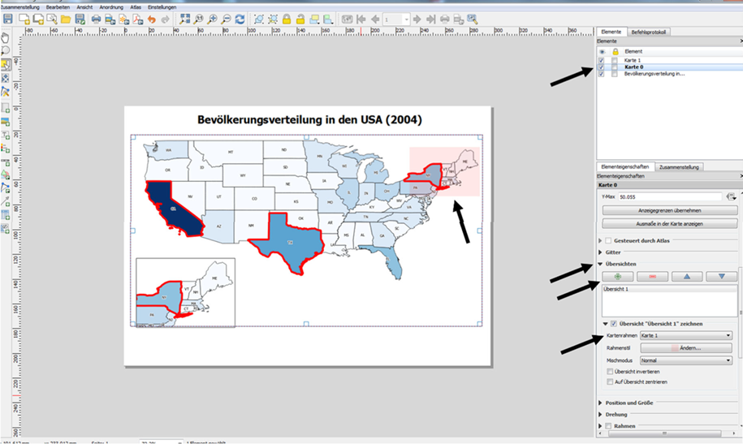
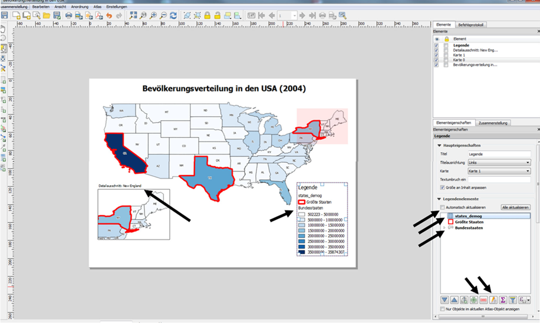
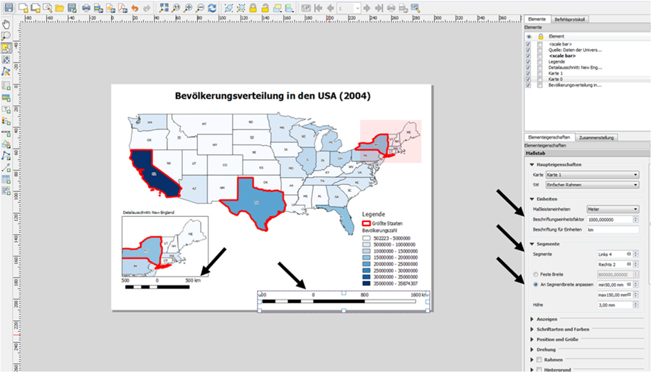
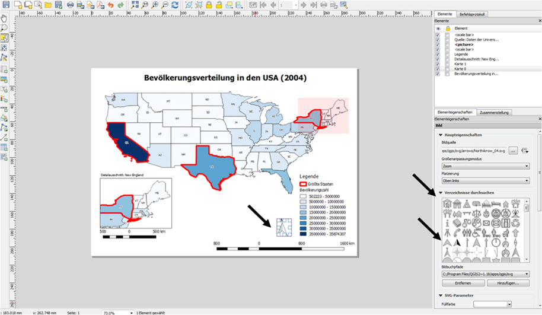

- You can export your map via the menu bar under "Composition" (e.g., as a PDF or as a PNG via "Save as raster image").

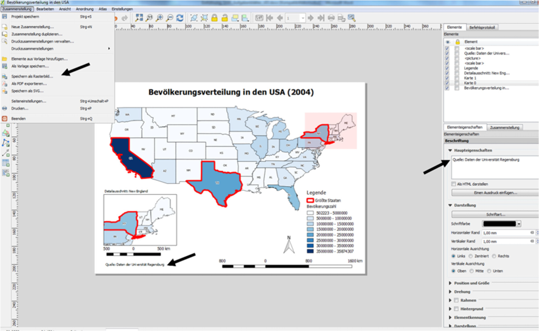

### Solution
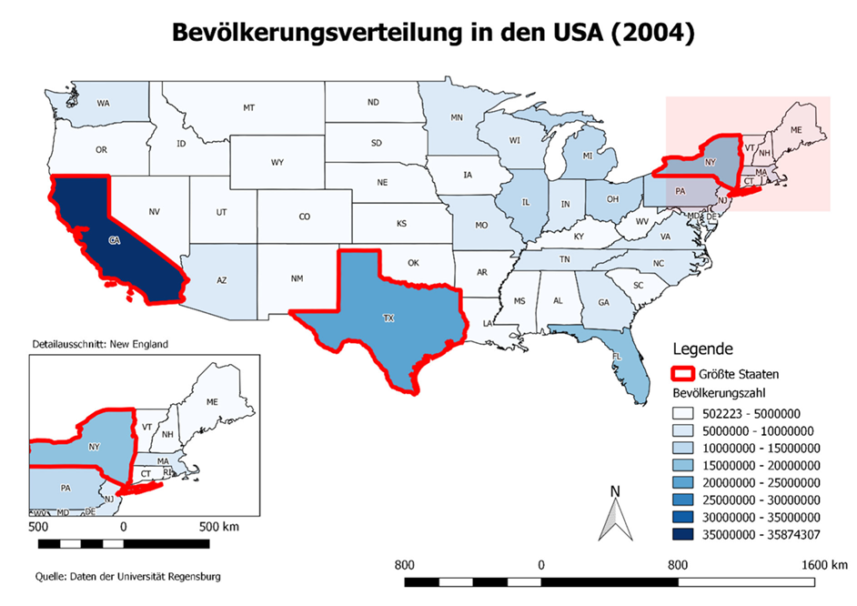

## Task 2: Aldi branches in Regensburg - Round trip

### Problem
In this exercise, you should draw the location of the Regensburg Aldi branches and a fictitious regional warehouse on a map of the Regensburg city area with a suitable formatting. You would then like to measure the linear distance between the branch in the western quarter and the branch on the Galgenberg. You then want to draw an exemplary round trip between the regional warehouse and the branch-es and save it as a line layer.
Use the following data for this:
- Path: Exercise 2
    - Excel file with coordinates
    - Bodies of water
    - Highway
    - Railroad

### Walkthrough
- Create a folder on your drive for this task. Copy the required data into this folder.
- First you have to determine the coordinates of the Aldi branches and the regional warehouse. Your colleague has already done a little preparatory work for this and determined the street ad-dresses of the branches from https://filialfinder.aldi-sued.de and saved them in an Excel file. Open the Excel sheet. He saved the coordinates in Gauss-Krüger Zone 3 format. Go to https://www.deine-berge.de/Rechner/Koordinaten/ and find out the remaining coordinates of the branches. **Caution: Format the coordinate cells in Excel in text format, otherwise the dec-imal delimitation will not be accepted!**
- Open QGIS and open the shapefiles and layer them so that they are all visible. Bring the project and all shapefiles to the Gauss-Krüger-3 EPSG 5678 coordinate reference system.
- Format the shapefiles according to common expectations:
    - The boroughs are white with a thin black border. Add the district name as a subtle caption.
    - The waters are blue with a thin black border.
    - The railway with a thick black and white dashed line. To do this, create a total of three lines in the "Line" field (click on the "plus"). Set the first line to black with a width of 1 and a user-defined dash (scroll down for this, then "Change"): Set the dash to "5" and the space to "4". Set the second black line to a width of 0.2 and an offset of -0.6. Set the third black line to a width of 0.2 and an offset of 0.6.
    - The highway as a thick gray line.

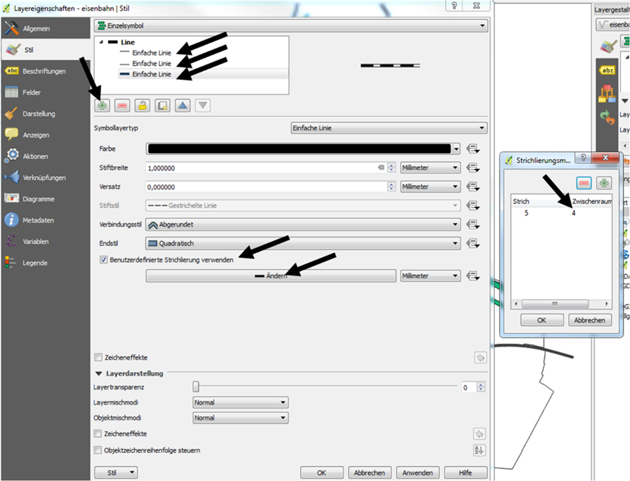
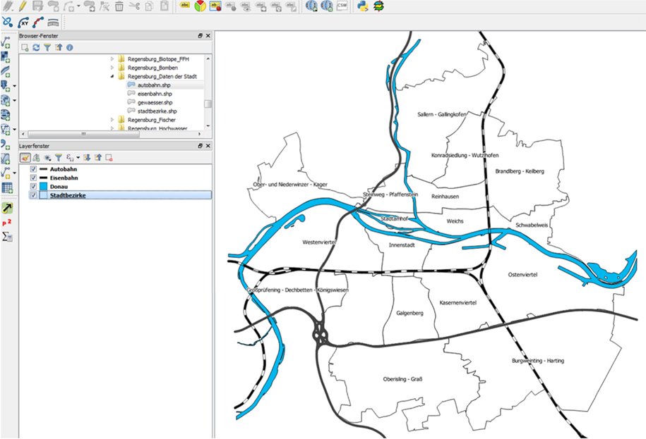

- Rename the shapes to "Autobahn", "Railway", "Danube" and "Districts".
- Download the Spreadsheet Layers plugin (Extensions menu bar).

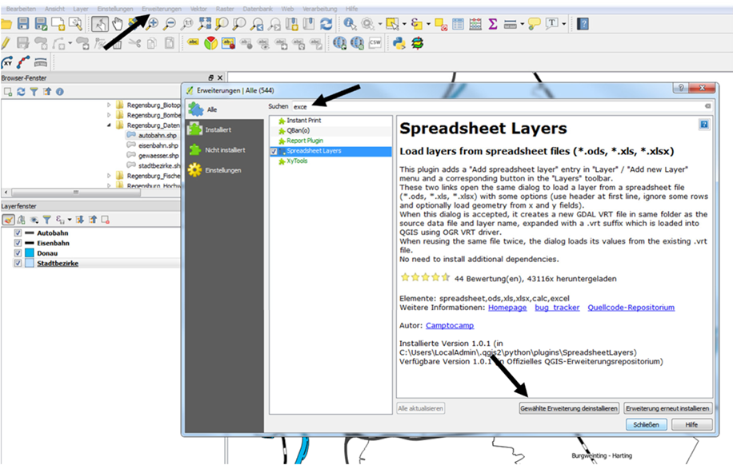

- Add the Aldi branches as a new point layer.
    - Menu Bar – Layers – Add Layer – Add Spreadsheet Layer.
    - Select the Excel file with the Aldi coordinates.
    - Check the "Geometry" box and set the X and Y field according to the Excel spreadsheet. Set the correct "Reference System" (EPSG:5678) and click "Ok". A new point layer has been created. Rename this to "Branch Regional Warehouse Network".

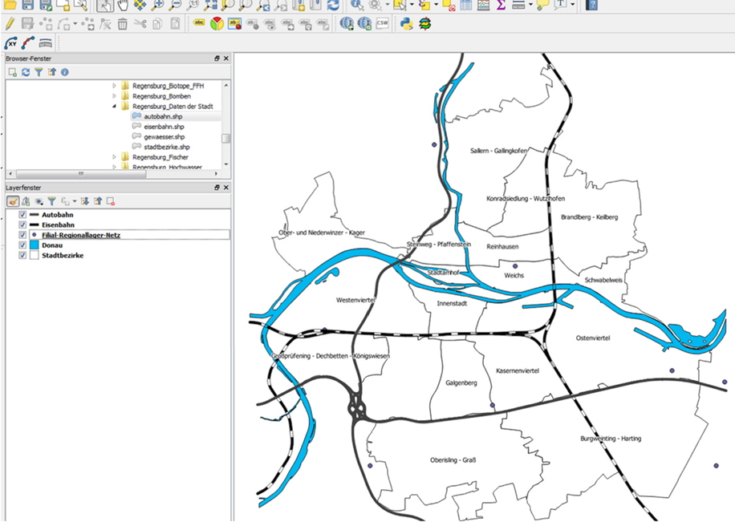

- Next, the individual points should be formatted according to their "type". The branches should be formatted differently than the warehouse.
    - Right click Point Layers – Properties – Style.
    - At the top of the window, select the "Rule-based" option instead of "Single symbol".
    - Click on the top entry and select the option "Add categories to the rule" under "Refine selected rules". Select the attribute "type" as the column and select "Classify". You can now format the individual types separately by double-clicking on the respective symbol.
    - Format the branches as green squares with size 3 (you can change the shape of the marker in the formatting field at the bottom), the regional warehouse as a red triangle with size 3.

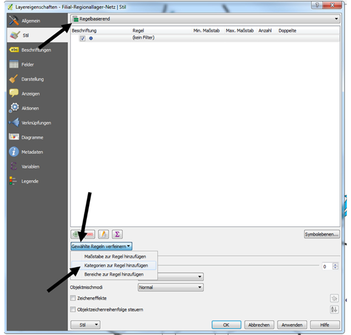
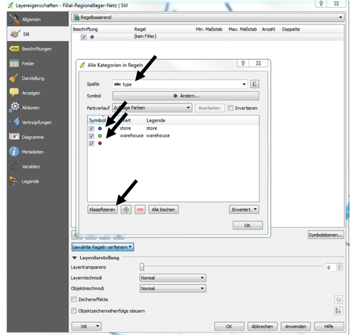
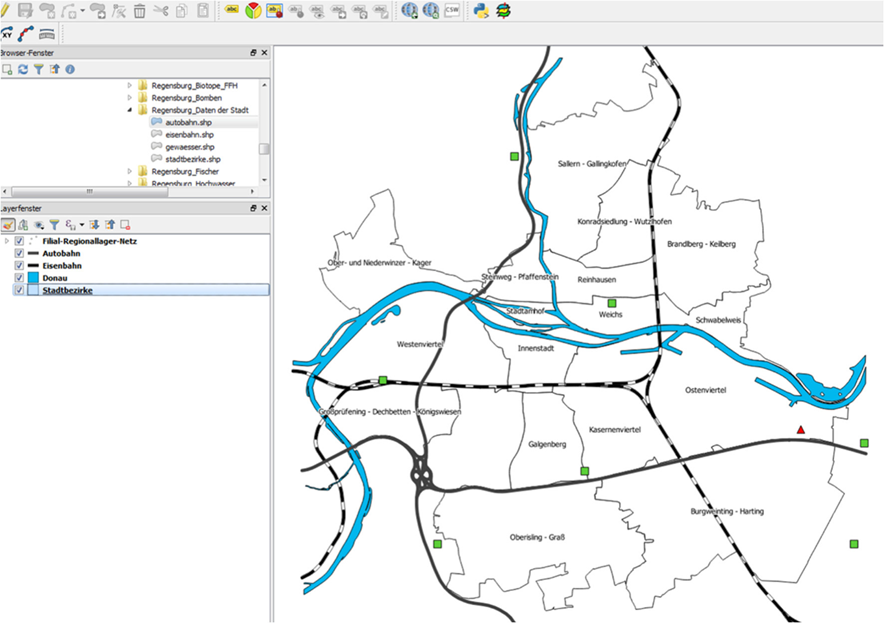

- Next select the measurement tool from the toolbar at the top. Click on the West Quarter branch and the Galgenberg branch and then right-click. The straight line is about 4,900 meters.
    - **Optional**: Check the precision of your measurement on luftlinie.org. The two addresses are Johann Hösl Straße 1, 93053 Regensburg, and Rennweg 15, 93049 Regensburg.
    - **Tip**: You have now used the measuring tool "manually". You can use a plugin such as "Point Connect" to generate a precise line be-tween the two points and determine its length.

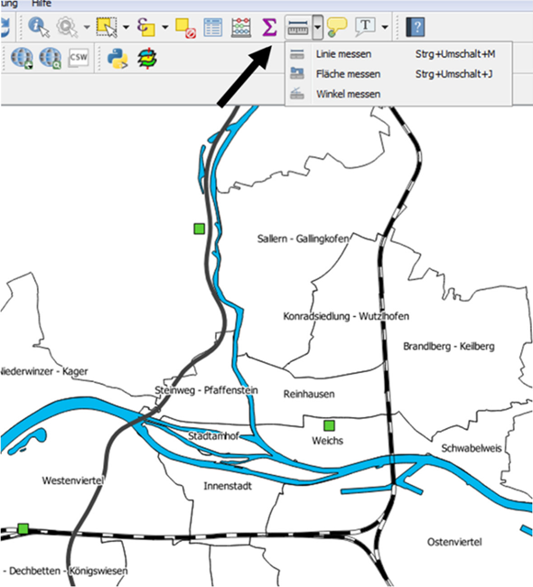
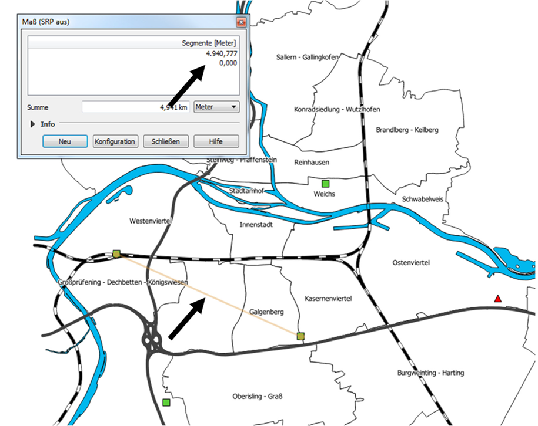

- Finally, you would like to create a line layer with which you would like to draw an exemplary tour between the regional warehouse and all branches.
    - Menu bar – Layer – Create layer – Create shape file layer.
    - Select "Line" and the correct coordinate reference system and click "Ok". Save the shape-file as "Tour" in your folder.
    - Switch on edit mode (small pen in the upper right corner) and select "Add object". Create a circular tour on the outer edges of the branch network by clicking on the individual points. End the line creation with a right click. Give the round trip the ID "1". Then switch off the editing mode and save the changes.
    - Format the round trip according to your taste. In this example, it has been formatted as a thick orange line.

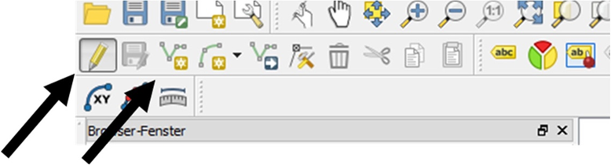

- Finally, you want to calculate the length of the round trip you have created. In the layer window, click on the "Trip" layer and select the "Field calculator" icon in the toolbar.
    - Select "Create new field". This field is added to the round tour layer's attribute table. Name the field "Length". In the right expression box, look for "Geometry" and the command "$length". Double-click the command and click "Ok".
    - Turn off edit mode and save the changes.
    - You can now read out the length of the round tour in the attribute table of the "Tour" layer.

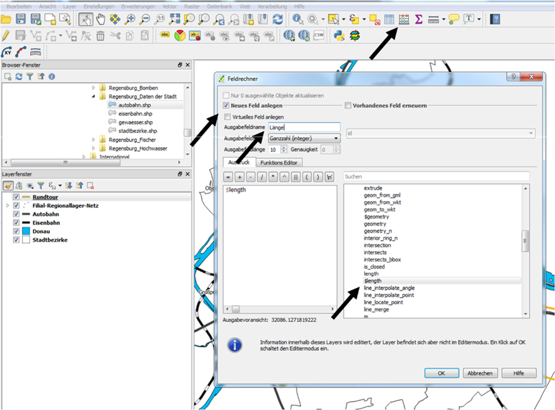

### Solution
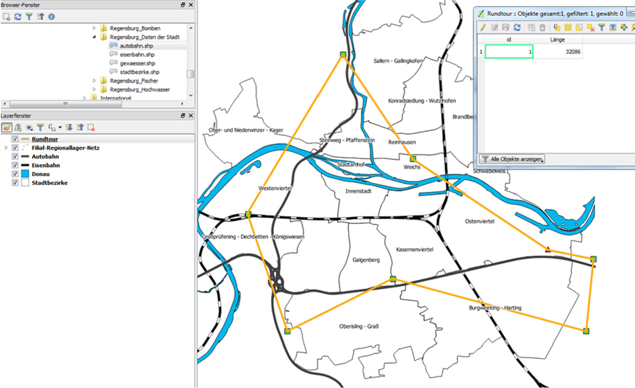

## Task 3: Aldi branches in Regensburg - Market reach

### Problem
Based on the map generated in Task 2, an estimate of the market covered by the Aldi branches in Regensburg is now to be made. Various tools must be used for this. The aim of this exercise is to find out how many customers reach the Regensburg Aldi branches within a radius of 2 kilometers from each Aldi branch in the city districts of Regensburg.

Use the following data for this:
- Your project created in Task 2. For this exercise, save it as a separate project.
- Path: Task 2
    - Population_Rgb

### Walkthrough
- Turn off the round-trip layer from the previous exercise. The Gauss-Krüger-3 system zone 3 (EPSG 5678) is also used in this exercise.
- To determine the number of customers in the vicinity of the branches, it is first necessary to collect more detailed information on the city's population. A colleague found a table on the website of the city of Regensburg (Regensburg Statistics) and saved it as Excel "Popula-tion_Rgb" for you.
    - Add the Excel to your project and link it to the "Districts" layer (layer properties -> Links -> Add link (green plus below) -> Target field and link field are "SBZ". The linked field is "Population").

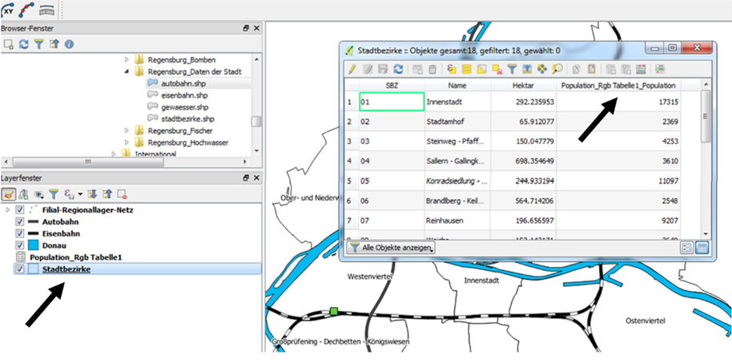

- Since the branches are to be considered below, you can deactivate the "warehouse" layer.

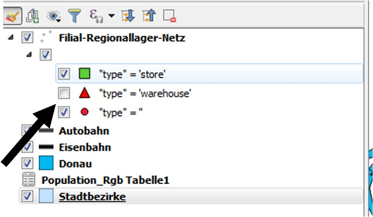

- First, circles should be drawn around the branch with a radius of 2 kilometers.
    - Menu bar: Vector – Geoprocessing Tools – Fixed Distance Buffer
    - The input layer is the store-regional warehouse network. The distance is given in meters. So, 2000 is entered here. The "Segments" field indicates how "round" the perimeter should be designed. Since we want a circle, we enter a higher value, e.g., 100.
    - Click "Run". A new layer is created called "Buffer".
    - There is still a buffer in the result that is assigned to the "warehouse". Open the attribute table of the buffer layer and remove the entry with the "type" "warehouse" (switch on edit mode (small pen), mark the line, button "Delete", then switch off edit mode and save).

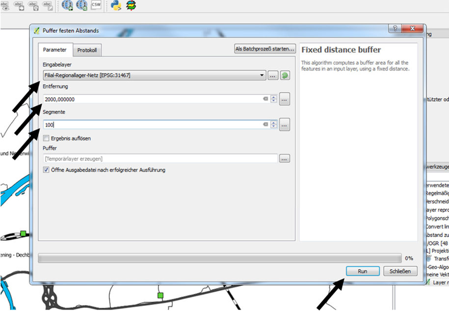
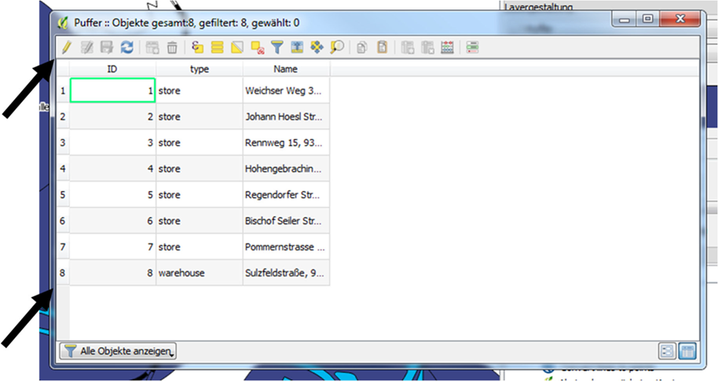
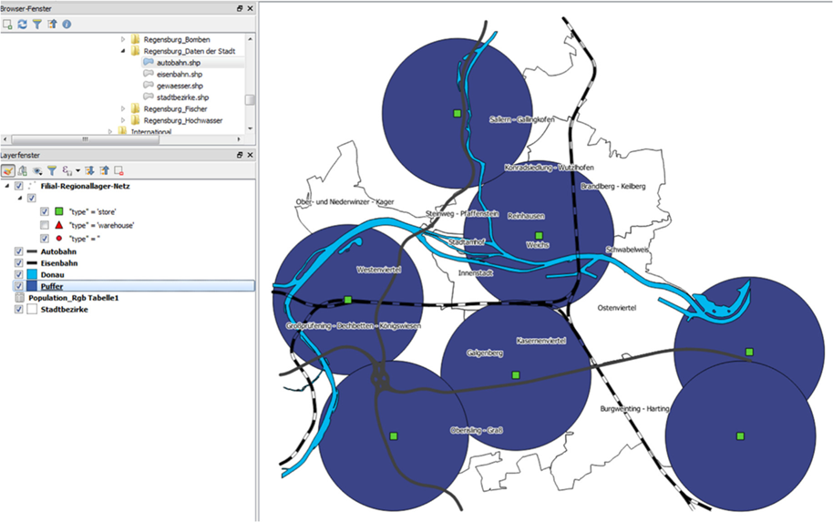

- The catchment areas of the branches sometimes overlap. However, customers in the intersection areas should not be counted twice when determining the number of customers. The catchment areas should therefore form a "common" layer.
    - Under Vector – Geoprocessing Tools, select Dissolve. This command aggregates layers, i.e., layers and their overlaps are "merged". The input layer is the buffer layer created earlier. Click "Run". The result is a new shape file that depicts the market catchment area of the branches without duplication.
    - Rename the new shapefile to "Catchment" and turn off the old buffer layer.
    - Format the catchment area with a subtle and transparent color.

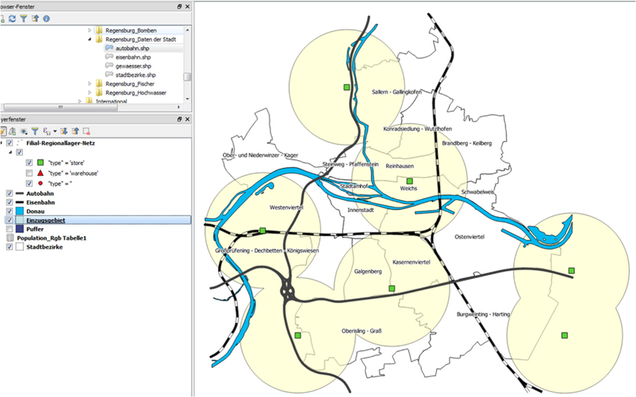

- Since we want to find out how many people are in the service area within the boroughs, we need to determine the overlapping areas of the service area layer and the borough layer.
    - Menu bar: Vector – Geoprocessing Tools – Grading
    - The input layer is the market catchment area, the intersect layer is the borough layer. Click "Run". A new layer is created that only contains the intersection areas. Rename this layer "Metropolitan Service Area". Format it in a subtle and transparent color.

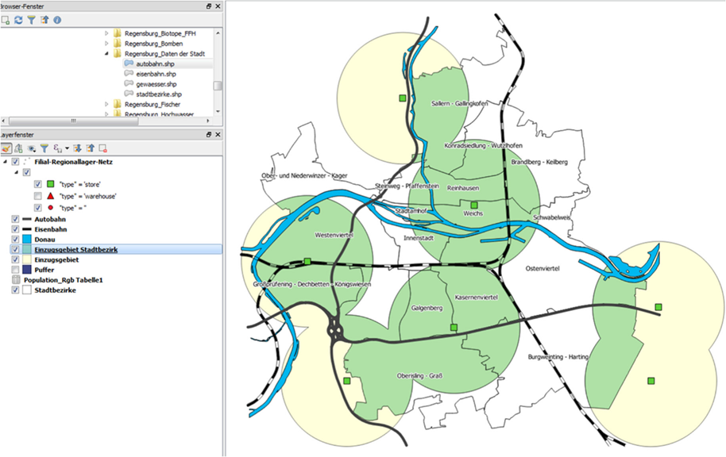

- The sizes that can be read out in the attribute table ("hectare", "population") still refer to the original size of the city districts! Since we assume that the people in the city dis-tricts are evenly distributed, we must therefore determine the absolute geometric size of the intersection and then set this in relation to the size of the city districts. The result can then be multiplied by the number of inhabitants per district.
    - Select the "City catchment area" layer and open the field calculator (toolbar).
    - Create a new field called "Size of cut area". Under "Geometry", double-click the "$area" command and execute the command. A new column was created in the attribute table, which indicates the size of the cut surface in square meters.
    - Stay in edit mode and reopen the handheld calculator. Create a new field called "Percent Area Municipality". Set the output field type to "Decimal number (real)". If the percentage of the intersecting area is to be calculated, the size of the city districts (given in hectares) must be converted into square meters (including the quotation marks): "Size of intersect-ing area" / ("hectares" * 10000).
    - A new column was calculated in the attribute table of the layer, which indicates the cover-age of the respective city district in percent. City districts such as Reinhausen or Weichs are completely covered. Ober-/Niederwinzer-Kager and Brandlberg-Keilberg show little coverage.
    - Finally, the covered intersection areas must be offset against the population of the respec-tive city district. Open the field calculator again and enter "Customers Reached" as the output field name. Use integer as field type. As a command, enter: "Population_Rgb Ta-ble1_Population" * "Percentage Area Municipality".
    - Exit edit mode and save your changes.
    - If you open the attribute table, you can now read out the number of customers reached in each individual city district.

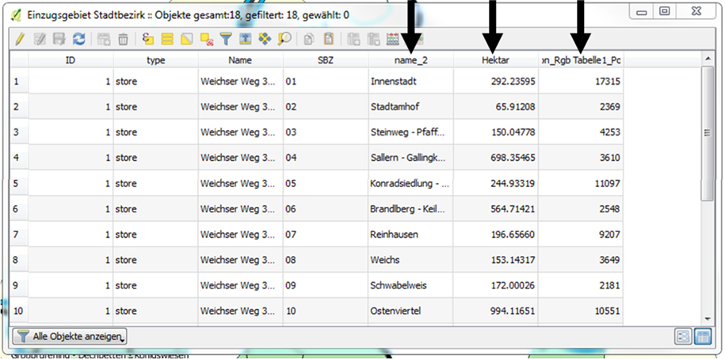
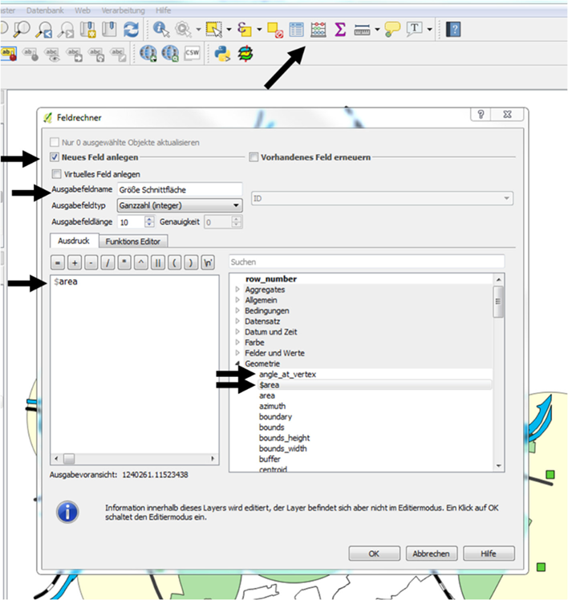
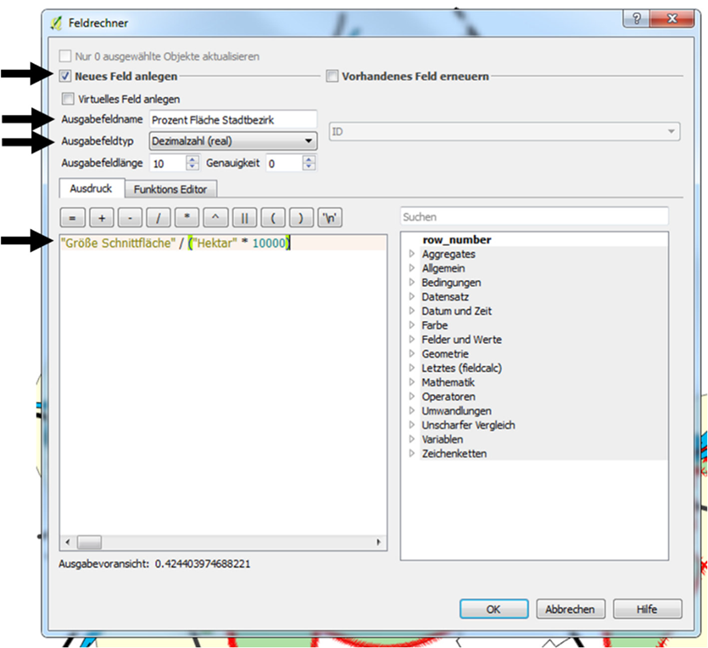
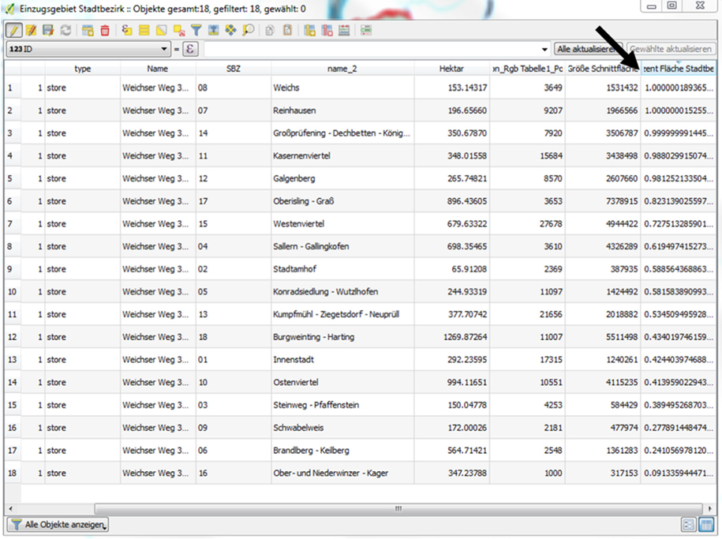
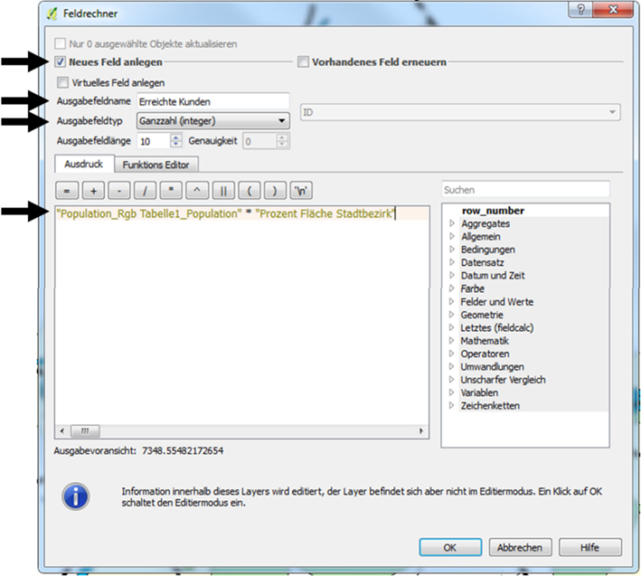

- Download the "Statist" extension (menu bar  Extensions).
- Open Statist via the menu bar  Vector. Open the "City catchment area" layer and click "Ok". Now read out the summarized results of your analysis.
- **Optional for self-study:**
    - Generate a professional and complete map of your results!
    - Suggest a new branch location in the Ostenviertel! Create a new point layer "New Branch" and set a coordinate of your choice in the East Quarter as the new location. Calculate how many more customers you can reach through the new branch!

### Solution
The Regensburg Aldi branches reach a total of 108,045 customers in the Regensburg city area. The assumptions are that the customers are evenly distributed in the city districts and that the Aldi branches each have a catchment area of 2 kilometers.

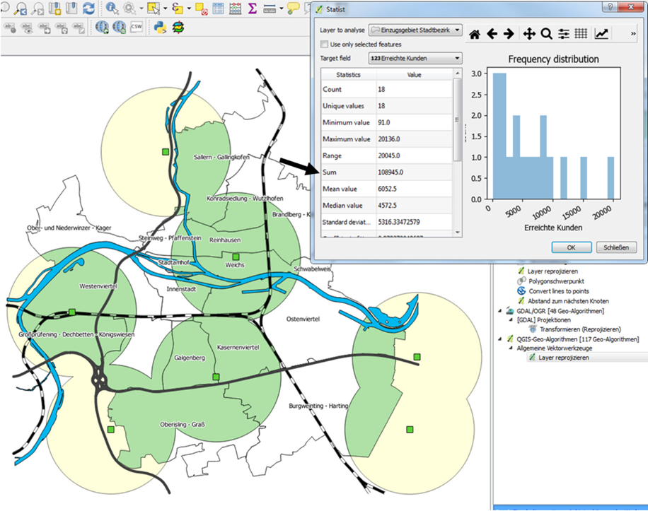

## Task 4: Distribution network

### Problem
In this exercise, various calculations and models are to be made for a fictitious supply chain network in Bavaria. This network is divided into warehouse locations and branches. The branches are supplied with goods from the nearest warehouse location.

The methods learned in this exercise will help you with various supply chain analyzes using QGIS. Specifically, should ...
1. ... the distances between the geometric focal points of the delivery areas and the storage lo-cations be determined (polygon focal points and distance matrices).
2. ... a proposal be made for a general distribution of delivery areas (Voronoi polygons).
3. ... the flow of goods between the warehouse locations and the branches be mapped in an appropriate form.

Use the following data for this:
- Path: Exercise 4
    - All given shapefiles
    - Excel files

### Walkthrough
- General: In this exercise, the Gauss-Krüger Zone 3 system (EPSG 5678) is used.

#### Subtask 1: New delivery areas (at district level) are to be developed in south-eastern Bavaria. Which of the new delivery areas should be supplied from which regional warehouse?
- Create a folder on your drive for this task. Copy the required data into this folder.
- Open QGIS and load the given data. Use Gauss-Krueger-Zone-3 EPSG 5678 as the projection. Get an overview of the given data and its content. Sort the layers so that all are visible and format them appropriately.

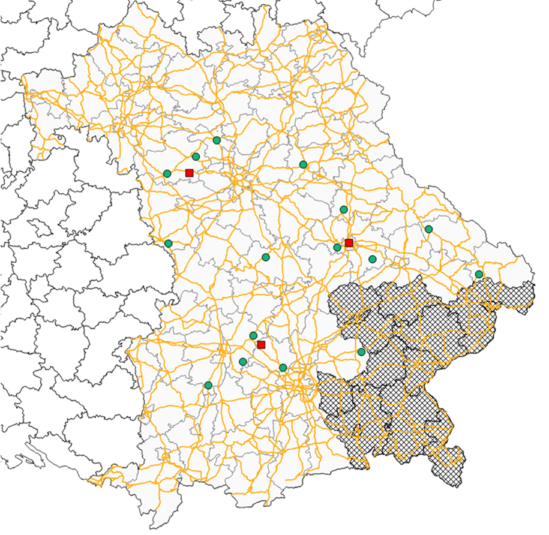

- The new areas to be supplied are in south-eastern Bavaria (shaded areas). It has to be found out which delivery area should be served from which regional warehouse – it should be assumed here that the decision should only be based on the shortest average distance. Furthermore, assume that the customers are evenly distributed in the delivery areas.
- A distance matrix between all warehouses and all delivery areas should be generated for deci-sion-making. This allows a minimal distance assignment.
- The delivery areas are "unshaped" polygons. However, fixed points are required to generate a distance matrix. In the following, these are to be set in the geographic focus of the delivery are-as.
    - Open Menu Bar – Vector – Geometry Tools – Centroid. Use the delivery area layer as the input layer and click "Run".
    - A new layer "centroids" was created, which includes the centroids of the delivery areas. Format them appropriately.

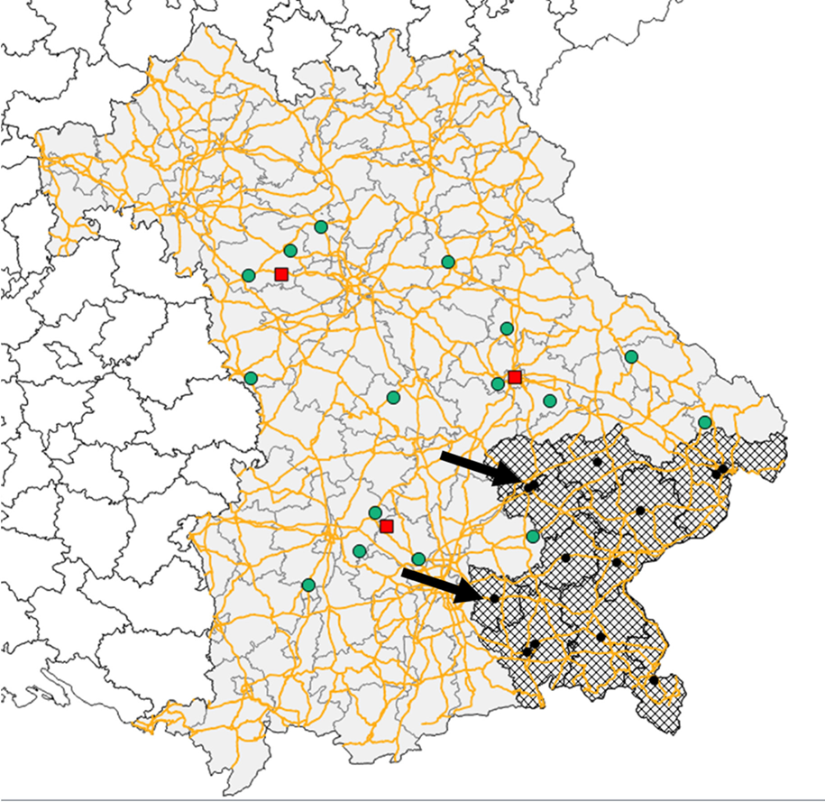

- Next, the distance matrix is generated. The IDs of the warehouse locations and the community names of the delivery areas should be used as identifiers for the rows and columns.
    - Open Menu Bar – Vector – Analysis Tools – Distance Matrix. Select the layer of the bear-ing network as the input layer. Choose ID as the unique key field. The target layer is the centroid layer. Choose GEN as the unique key field. The output matrix shall be a standard (NxT) distance matrix.
    - Click "Run". A new "Distance Matrix" table has been created in which you can read the distances in meters. Since location 1002 (Northern Bavaria) is the furthest away from the delivery areas, you can remove it from the distance matrix (switch on edit mode, mark line, delete, switch off edit mode and save).
    - Now read out the shortest distances and make your allocation decision. The solution can be found in the sub-chapter "Solution".

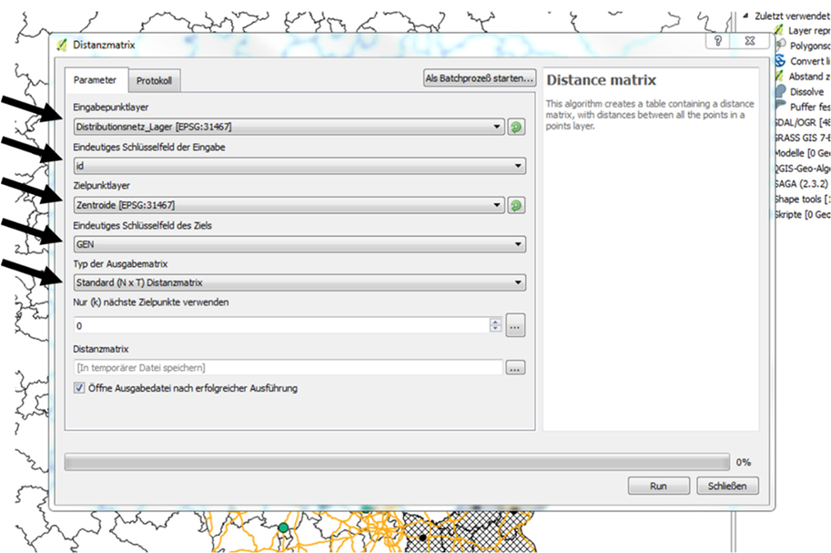
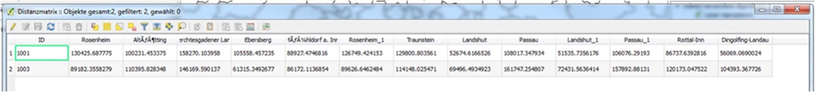

#### Subtask 2: Make a distance-based proposal for the division of all of Bavaria to the three camp locations!
- As there will be further expansion in the future, it makes sense to allocate the rest of Bavaria to a storage location. It should be assumed that only three storage locations will continue to be used. The allocation of a delivery area to a warehouse location should again be based on distance. This time, however, no centroids should be used.
- Deactivate the "Delivery Areas" and "Centroids" layers.
- One possibility for distance-based classification is to create a Voronoi polygon. Voronoi poly-gons are polygons that result from the collected "center lines" between any given point. They thus show the borderlines of possible assignments.
    - Open Menu Bar – Vector – Geometry Tools – Voronoi Polygons.
    - The input layer is the bearing mesh. The "Buffer" represents the overhang of the polygon – since we want the polygon to cover all of Bavaria, we choose a high buffer of 100 and click "Run".
    - The result is a new layer that maps the Voronoi polygons.

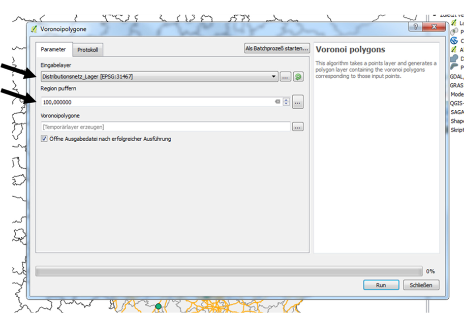
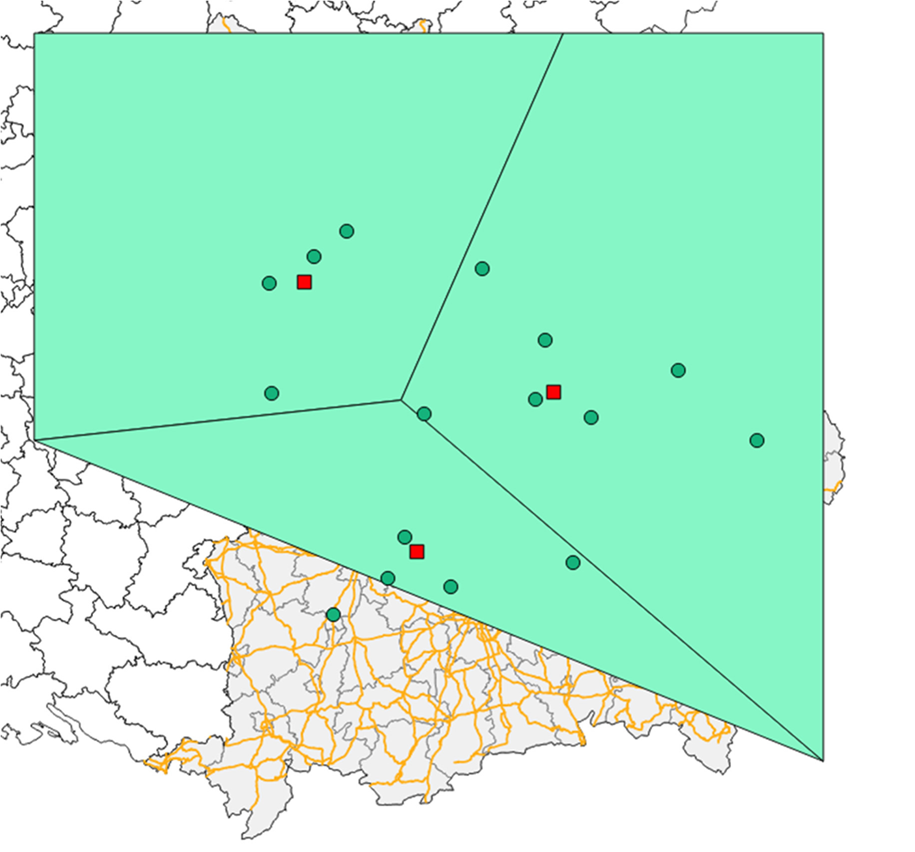

- First, let's make the newly created layer transparent (60% transparency). The three center lines of the polygon represent the boundaries of the allocation. Bavaria is divided into three seg-ments: north, east, and south. The storage locations located there are those locations that are closest to this area.

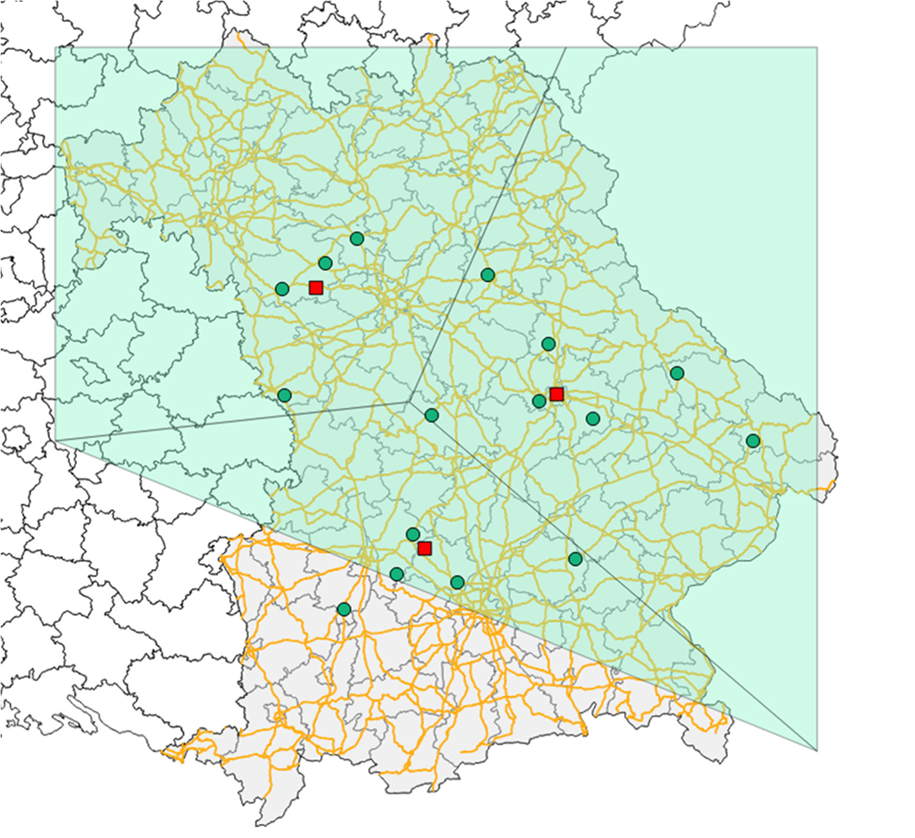

- The proposed assignment should now be graphically processed better. Within the "Distribu-tionsnetz_Bavaria" layer, the center lines defined by the Voronoi polygons should represent the dividing lines. If we were to make an intersection of the Bavaria layer with the current Voronoi layer, then southern Bavaria would be separated by an unnecessary line and therefore not fully included and some areas of Bavaria would not be included in the intersection layer (see e.g., East, and North). So, we have to enlarge the Voronoilayer a bit so that it covers all of Bavaria.
    - Select the Voronoi layer and switch on the edit mode (small pen in the top left).
    - Choose the node tool. Double click on the outlines – this will add a new node to the edge. You pull this knot outwards to make the Voronoilayer so large that it encompasses all of Bavaria. Caution: Do not change the center lines!
    - Exit edit mode and save your changes to the Voronoilayer.
    - Now you can intersect the Voronoi layer with the Bayern layer (Menu Bar – Vector – Geo-processing Tools – Intersect). The input layer is the Voronoi layer, the "cut layer" is the Bavaria layer.
    - Rename the newly created layer as "Store assignment" and deactivate the Voronoilayer. Format the layer in a pleasing color and switch it to 50% transparency. Activate the label-ing of this layer and label the individual parts with the ID of the respective bearing in a legible font size (Properties  Labels  above: "Label this layer"  Label with "ID").

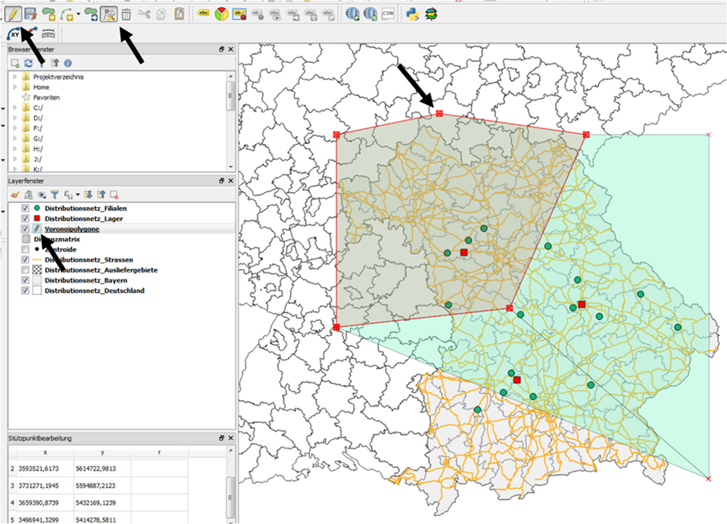
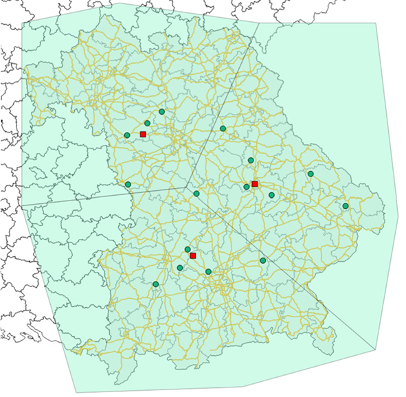
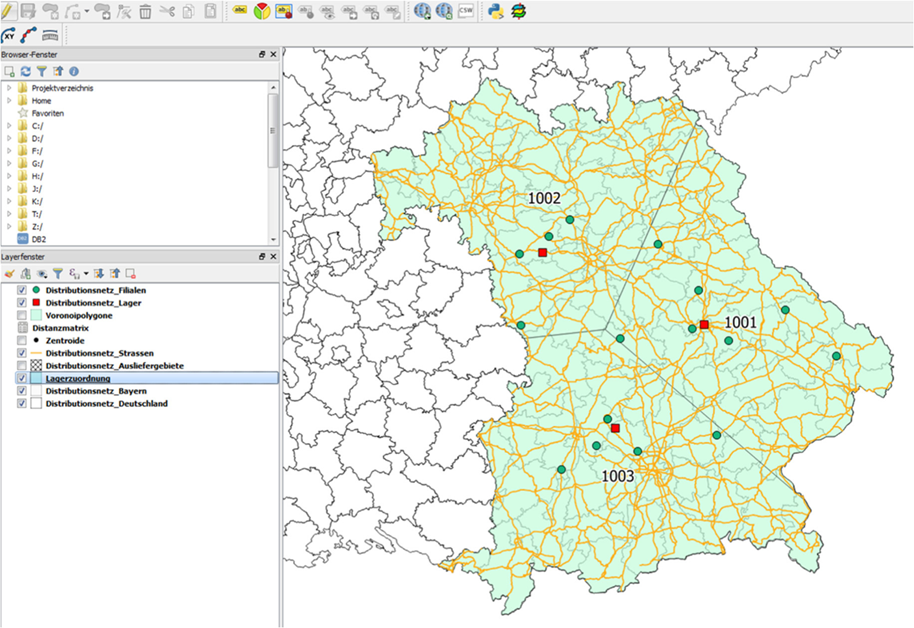

#### Subtask 3: Show the flow of goods between the branches and the regional warehouses in different col-ors according to their intensity!
- Deactivate all layers except Distributionsnetz_Bayern and the point layers of the branches and warehouses. Zoom in on the branch layer (Right click on the layer -> Zoom on layer)
- Download the "PointConnector" plugin (menu bar -> Extensions). This plugin creates lines be-tween the points of a layer. The plugin requires a CSV file for this, which you can generate based on an Excel sheet. In this file, the connections of the points must be mapped with two columns: [from] and [to]. The IDs of the respective points are written into these columns.
    - Your colleague has prepared two Excel sheets for you. Flows of goods_total shows all flows of goods and their respective weights. Flows of goods_connections is an excerpt from the previous sheet and only contains the connections between warehouse and branches ([from] and [to]). You must make this separation so that the plugin works smoothly.
    - **Caution**: The weight of the connections specified in Warenverbindungen_total must be formatted in number format! Otherwise, the formatting will no longer work later.
    - Save the Flow of Goods_Connections sheet as a CSV file (MS-DOS). Confirm the message fields.
    - Drag and drop the CSV file and the Excel sheet Flows of Goods_Total into the QGIS layer window.
- PointConnector would like to find the points to be connected in a common (!) layer file. There-fore, we need to merge the Store_Layer and Warehouse_Layer. If we were to choose the Unions geoprocessing tool, the layers would be merged, but their attributes would be presented in separate columns. Since the two layers have the same formatting in their attribute tables (ID and type), we can use an alternative tool to merge them in such a way that the respective data is en-tered in the same columns.
    - Menu bar -> Vector -> Database management tools -> Merge vector layers.
    - Select the two point layers and click "Run". A new merged layer with equal attribute columns is created. Rename this layer "Goods Flow Network". Disable the separate store and warehouse layers.
    - Label the goods flow network layer with the IDs of the nodes (right-click layer  Proper-ties  Label  above: Label this layer  Label with ID). Choose a larger font size, e.g., 16. For "Placement", increase the distance to 3.
    - Format the goods flow network layer with black squares.

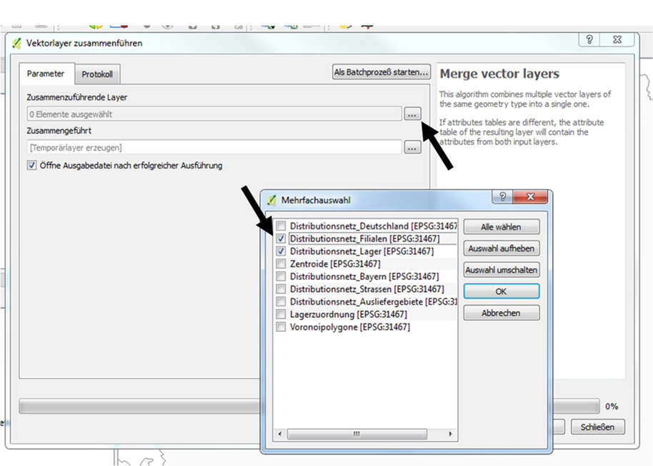
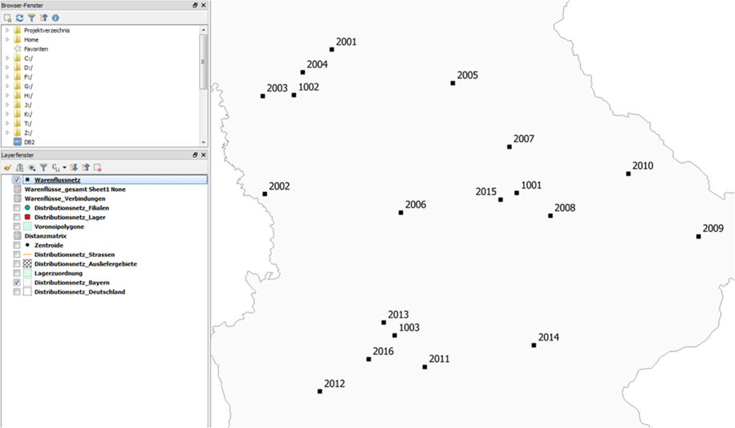

- Open the Pointconnector plugin under Menu Bar – Vector. Select the goods flow network as "Points" and the CSV file Warenfluß_verbindungen as "From-to List". Click "Ok". The lines are drawn in a new layer. Rename this layer "Goods Flow".

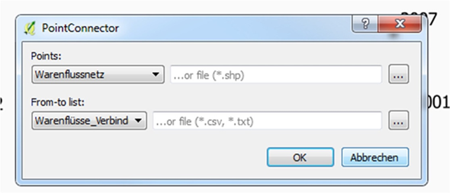
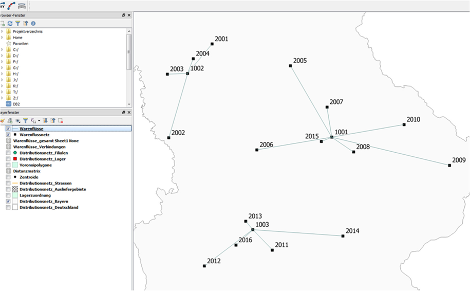

- The lines should now be formatted according to their weight. However, since the line layer just created does not have any weights per se, it must be linked to the Excel sheet Flows of goods_total.
    - Right-click goods flow layer – properties – links.
    - Add a shortcut using the green plus below. Associate the layer with Goods_flows_total. Link field is the path_ID, target field is the ID.
    - As linked fields select "weight". The weights were then assigned to the respective flows.

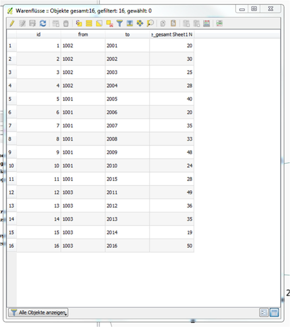

- Now you can format the flow of goods.
    - Right click Goods flow layer – Properties – Style.
    - Select "Categorized" at the top and select "weight" as the column. Click on "Classify" below and select a suitable gradient under Color gradient.
    - The flow of goods should also be marked as bold arrows. Under "Icon" click on "Change". In the next window, select the "Arrow" option instead of "Simple marking". Change Ar-row Width to 4, Tip Length to 3, and Tip Strength to 4. Make sure the Curved Arrows op-tion is checked. Click "Ok" and finish formatting.
    - Move the "Goods flow network" layer up in the layer window so that warehouses and branches become visible.
    - Some of the arrows overlay each other unfavorably: Select the "Flow of Goods" layer and switch on the editing mode (small pencil at the top left). Select the node tool and add a new point to individual arrows by double-clicking in the middle. You can push this point outwards: the arrow bends. Bend those arrows that you find appropriate. Turn off edit mode and save your changes.

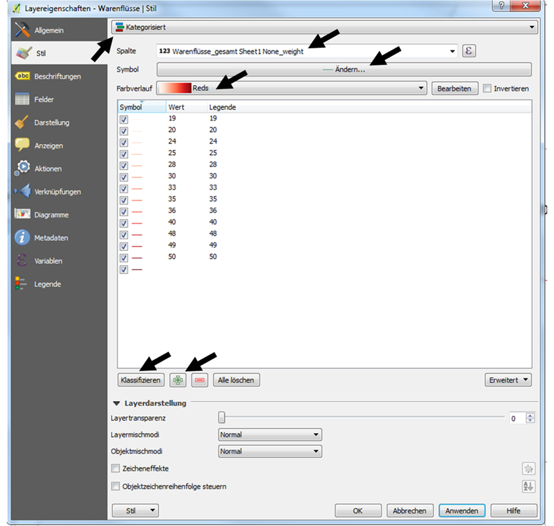
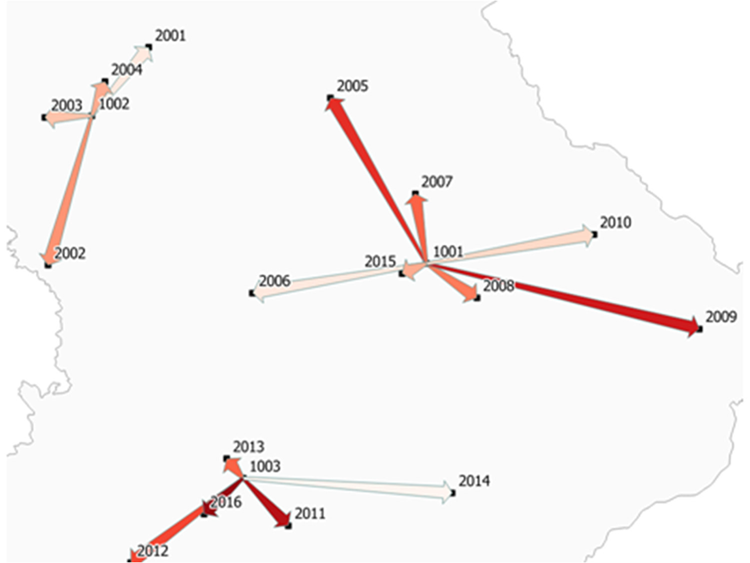
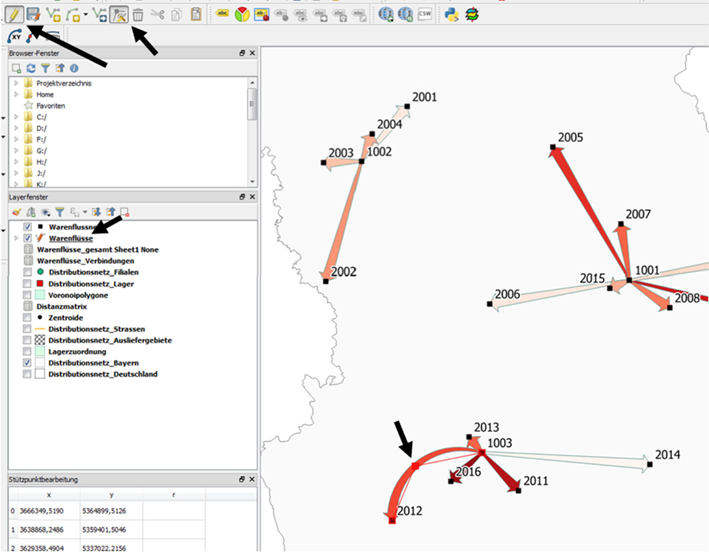

### Solution

#### Subtask 1
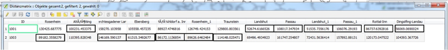

#### Subtask 2
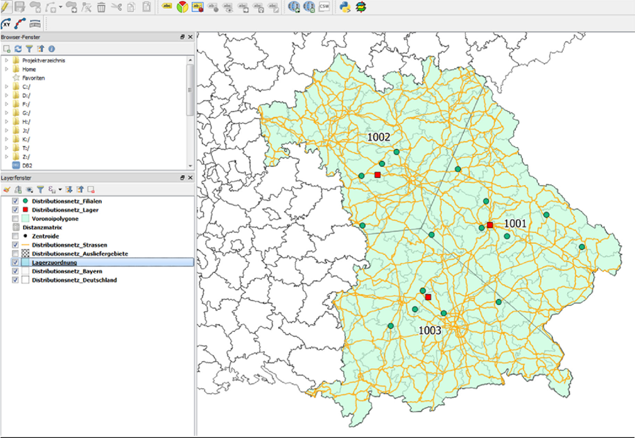

#### Subtask 3
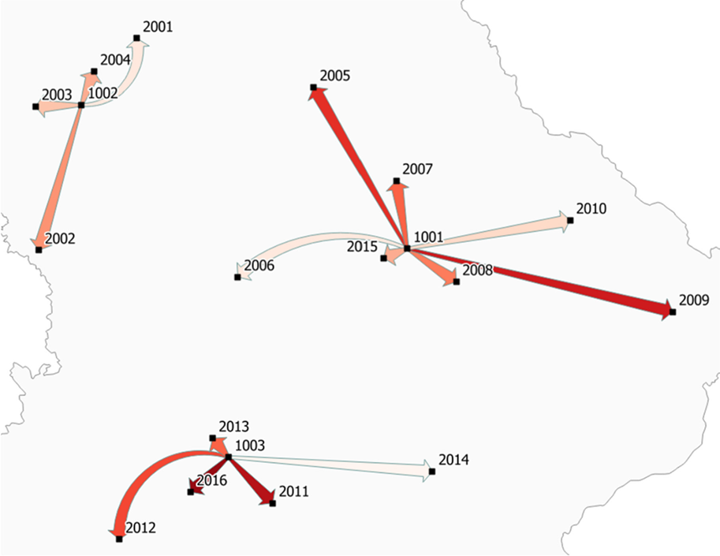

## Troubleshooting
### Generally
- If you come across an error or something doesn't work: don't give up – it's often a small error. Google your problem or try to systematically change your approach.
- Always format coordinates in Excel spreadsheets as text, otherwise the American decimal point (e.g., 49.28) will not work.
- Always format values such as weights as number format, otherwise the categorized formatting will not work in QGIS.
- Do not use umlauts or ß.
### Projection
- Choosing the "right" projection...
    - ... creates a "correct" image of your map.
    - ... ensures that the data you enter ends up where it should.
    - … is – especially for non-geographers – a typical source of problems when working with QGIS.
- Always check which projection your project and layers have. Make sure all layers are on the same projection.
- Work with the Gauss-Krueger transformation for the area Germany.
- In the case of externally obtained data, check which projection they show and, if necessary, carry out a reprojection in QGIS.
    - Either: "Set CRS for layer" (see previous slide)
    - Or: "Reproject layers" tool (menu: Processing -> Toolbox -> Search: "Reproject layers").
    - Or: Save the layer again with a new CRS.
